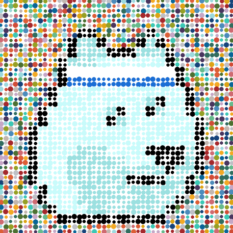
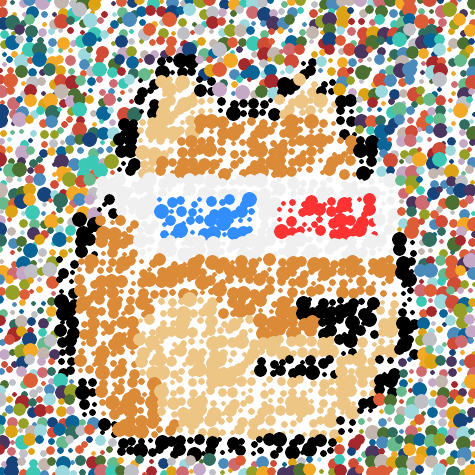
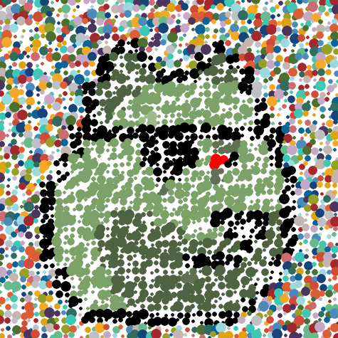
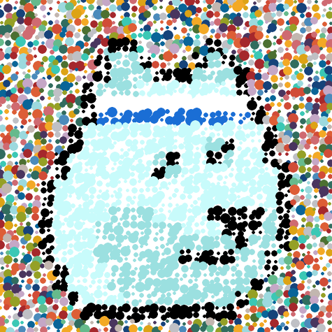

# Currency Art Collection Quick Starter - Generate Your Own Currency Dodge Collections


Let's start with the 25 Dodge (Shiba Inu) Punk series.


Note: See
[**Pixel Art Collection Quick Starter - Generate Algorithmically Your Own Curated (or Randomized) Collection**](https://github.com/cryptopunksnotdead/punks.starter)
to create your own dodge punk series from scratch.


Let's turn the "classic" 24x24 dodge (shiba inu) punk series
into Damien Hirst's "The Currency" inspired
modern dotty spotty art.


## Step 1 - Read in the all-in-one composite image


``` ruby
require 'pixelart'

dodges = ImageComposite.read( "i/dodge.png", width: 24, height: 24 )
```

Yes, that's it.
To double check that we got 25 dodge punks try
the (tile) count:

``` ruby
dodges.count #=> 25
```

Bingo!


## Step 2 - Turn the 24×24 Pixel Art into Modern Spotty Dotty Art


Let's loop over all punk images in the composites one-by-one:


``` ruby
dodges.count.times do |id|
  dodge = dodges[id]

  ###
  #  for testing generate "basic"
  #     dodge images with spots (no "currency" background)
  dodge_spots = dodge.spots( 10 )
  dodge_spots.save( "tmp/dodge-#{id}-spots-v1.png" )

  dodge_spots = dodge.spots( 5,
                  spacing: 5, center: [-1,1], radius: [3,6] )
  dodge_spots.save( "tmp/dodge-#{id}-spots-v2.png" )
end
```

Let's have a looksie at the first spots version (240×240 -- 24×10px spots)
for dodge #0, #6, #10.


And the second spots version (235×235 -- 24×5px spots + (24-1)×5px spacing)
for dodge #0, #6, #10.


Let's add the "magic" currency background spots
and rerun the the loop:

``` ruby
BACKGROUND_SPOTS = [
 # blue-ish
 '49355E', '16437A', '096598', '4B8BBB', '9CD9DE', 'C5A7C6',
 # red-ish
 'A5282C', 'D14C37', 'CF6A71', 'DD5E36', 'DDA315', 'F3A925',
 # green-ish
 '4C7031', '95A025', '66BA8C', '316D5F',
 # gray-ish /white-ish
 'C2B6AF', 'BFC0C5', '3BC8B5',
]

dodges.count.times do |id|
  dodge = dodges[id]

  #####
  #  collection №1
  dodge_spots = dodge.zoom(2).spots( 5, spacing: 5,
                             center: [-1,1], radius: [3,6],
                             background: BACKGROUND_SPOTS )

  dodge_spots.save( "o/no1/dodge-#{id}-currency@2x.png" )


  #####
  #  collection №2
  dodge_spots = dodge.zoom(2).spots( 5, spacing: 5,
                             center: [-3,3], radius: [2,8],
                             background: BACKGROUND_SPOTS )

  dodge_spots.save( "o/no2/dodge-#{id}-currency@2x.png" )


  # bonus: high-definition (hi-def) XXXL poster-size
  #          vector graphics quality
  dodge_spots = dodge.zoom(2).spots_hidef( 5, spacing: 5,
                              center: [-3,3], radius: [2,8],
                              background: BACKGROUND_SPOTS )

  dodge_spots.save( "o/no2/dodge-#{id}-currency@2x.svg" )
end
```


Yes, that's it.
Run the script to generate your currency collections.

In the `/o` directory you will now find two collections,
that is, `/no1` and `/no2`.
The `/no2` includes
a bonus high-definition (hi-def) XXXL poster-size
quality vector graphics version (see the `.svg` extension).


Let's have a looksie at the biggie 2x (475×475) versions
for dodge #0, #6, #10.

Collection №1





Collection №2






That's it.
Yes, you can! Change the currency spot colors to your liking
and generate your own currency dodge collections.


## Questions? Comments?

Post them on the [CryptoPunksDev (& CurrencyArtDev) reddit](https://old.reddit.com/r/CryptoPunksDev). Thanks.


