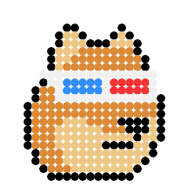
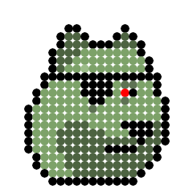
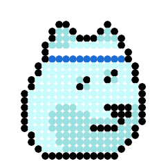
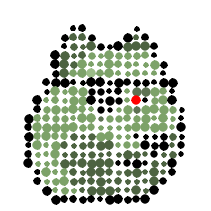
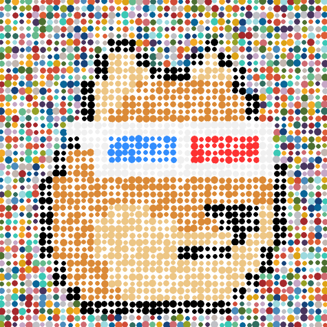
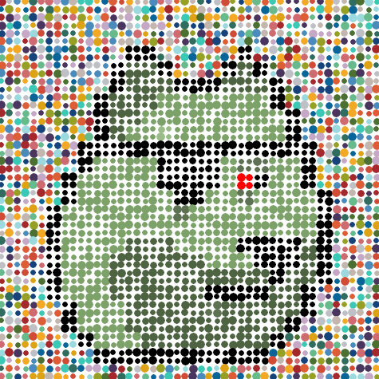

# Currency Art Collection Quick Starter - Generate Your Own Currency Collections


## Collection №1 & №2 - Doge

Let's start with the 25 Doge (Shiba Inu) Punk series.


Note: See
[**Pixel Art Collection Quick Starter - Generate Algorithmically Your Own Curated (or Randomized) Collection**](https://github.com/cryptopunksnotdead/punks.starter)
to create your own doge punk series from scratch.


Let's turn the "classic" 24x24 doge (shiba inu) punk series
into Damien Hirst's "The Currency" inspired
modern dotty spotty art.


### Step 1 - Read in the all-in-one composite image


``` ruby
require 'pixelart'

doges = ImageComposite.read( "i/doge.png", width: 24, height: 24 )
```

Yes, that's it.
To double check that we got 25 doge punks try
the (tile) count:

``` ruby
doges.count #=> 25
```

Bingo!


### Step 2 - Turn the 24×24 Pixel Art into Modern Spotty Dotty Art


Let's loop over all doge images in the composite one-by-one:


``` ruby
doges.each_with_index do |doge, id|
  ###
  #  for testing generate "basic"
  #     doge images with spots (no "currency" background)
  doge_spots = doge.spots( 10 )
  doge_spots.save( "tmp/doge-#{id}-spots-v1.png" )

  doge_spots = doge.spots( 5,
                  spacing: 5, center: [-1,1], radius: [3,6] )
  doge_spots.save( "tmp/doge-#{id}-spots-v2.png" )
end
```

Let's have a looksie at the first spots version (240×240 -- 24×10px spots)
for doge #0, #6, #10.





And the second spots version (235×235 -- 24×5px spots + (24-1)×5px spacing)
for doge #0, #6, #10.





Let's add the "magic" currency background spots
and rerun the the loop:

``` ruby
BACKGROUND_SPOTS = [
 # blue-ish
 '49355E', '16437A', '096598', '4B8BBB', '9CD9DE', 'C5A7C6',
 # red-ish
 'A5282C', 'D14C37', 'CF6A71', 'DD5E36', 'DDA315', 'F3A925',
 # green-ish
 '4C7031', '95A025', '66BA8C', '316D5F',
 # gray-ish /white-ish
 'C2B6AF', 'BFC0C5', '3BC8B5',
]

doges.each_with_index do |doge, id|
  #####
  #  collection №1
  doge_spots = doge.zoom(2).spots( 5, spacing: 5,
                             center: [-1,1], radius: [3,6],
                             background: BACKGROUND_SPOTS )

  doge_spots.save( "o/no1/doge-#{id}-currency@2x.png" )


  #####
  #  collection №2
  doge_spots = doge.zoom(2).spots( 5, spacing: 5,
                             center: [-3,3], radius: [2,8],
                             background: BACKGROUND_SPOTS )

  doge_spots.save( "o/no2/doge-#{id}-currency@2x.png" )


  # bonus: high-definition (hi-def) XXXL poster-size
  #          vector graphics quality
  doge_spots = doge.zoom(2).spots_hidef( 5, spacing: 5,
                              center: [-3,3], radius: [2,8],
                              background: BACKGROUND_SPOTS )

  doge_spots.save( "o/no2/doge-#{id}-currency@2x.svg" )
end
```


Yes, that's it.
Run the script to generate your currency collections.

In the `/o` directory you will now find two collections,
that is, `/no1` and `/no2`.
The `/no2` includes
a bonus high-definition (hi-def) XXXL poster-size
quality vector graphics version (see the `.svg` extension).


Let's have a looksie at the biggie 2x (475×475) versions
for doge #0, #6, #10.

Collection №1





Collection №2


That's it.
Yes, you can! Change the currency spot colors to your liking
and generate your own currency doge collections.


## Collection №3 & №4- Cool Cats

Let's start with the 221 Cool Cats TV Heads series.


Let's turn the "classic" 24x24 cool cat series
into Damien Hirst's "The Currency" inspired
modern dotty spotty art.


### Step 1 - Read in the all-in-one composite image


``` ruby
require 'pixelart'

cats = ImageComposite.read( "i/coolcats_tvheads.png", width: 24, height: 24 )
```

Yes, that's it.
To double check that we got 225 cats try
the (tile) count:

``` ruby
cats.count #=> 225
```

Bingo!  Note: The TV Heads composite ends with 4 "empties", thus,
the real count 221 (225 - 4).


### Step 2 - Turn the 24×24 Pixel Art into Modern Spotty Dotty Art


Let's loop over all cat images in the composite one-by-one:


``` ruby
221.times do |id|
  cat = cats[id]

  ###
  #  for testing generate "basic"
  #     cat images with spots (no background)
  cat_spots = cat.spots( 10 )
  cat_spots.save( "tmp/cat-#{id}-spots-v1.png" )

  cat_spots = cat.spots( 5, spacing: 5, center: [-1,1], radius: [3,6] )
  cat_spots.save( "tmp/cat-#{id}-spots-v2.png" )
end
```

Let's have a looksie at the first spots version (240×240 -- 24×10px spots)
for cool cats #0, #6, #12.


And the second spots version (235×235 -- 24×5px spots + (24-1)×5px spacing)
for cool cats #0, #6, #12.


Let's add the "magic" currency background spots
and rerun the the loop:

``` ruby
BACKGROUND_SPOTS = [
 # blue-ish
 '49355E', '16437A', '096598', '4B8BBB', '9CD9DE', 'C5A7C6',
 # red-ish
 'A5282C', 'D14C37', 'CF6A71', 'DD5E36', 'DDA315', 'F3A925',
 # green-ish
 '4C7031', '95A025', '66BA8C', '316D5F',
 # gray-ish /white-ish
 'C2B6AF', 'BFC0C5', '3BC8B5',
]

221.times do |id|
  cat = cats[id]
  #####
  #  collection №3
  cat_spots = cat.zoom(2).spots( 5, spacing: 5,
                             center: [-1,1], radius: [3,6],
                             background: BACKGROUND_SPOTS )

  cat_spots.save( "o/no3/cat-#{id}-currency@2x.png" )


  #####
  #  collection №4
  cat_spots = cat.zoom(2).spots( 5, spacing: 5,
                             center: [-3,3], radius: [2,8],
                             background: BACKGROUND_SPOTS )

  cat_spots.save( "o/no4/cat-#{id}-currency@2x.png" )


  # bonus: high-definition (hi-def) XXXL poster-size
  #          vector graphics quality
  cat_spots = cat.zoom(2).spots_hidef( 5, spacing: 5,
                              center: [-3,3], radius: [2,8],
                              background: BACKGROUND_SPOTS )

  cat_spots.save( "o/no4/cat-#{id}-currency@2x.svg" )
end
```


Yes, that's it.
Run the script to generate your currency collections.

In the `/o` directory you will now find two collections,
that is, `/no3` and `/no4`.
The `/no4` includes
a bonus high-definition (hi-def) XXXL poster-size
quality vector graphics version (see the `.svg` extension).


Let's have a looksie at the biggie 2x (475×475) versions
for cool cats #0, #6, #12.

Collection №3


Collection №4


That's it.
Yes, you can! Change the currency spot colors to your liking
and generate your own currency cats collections.


Unicorns? Dragons? Frogs? Try:

160 Unicorn series.  <br> 

51 Dragon series.  <br> 

51 Frog series.  <br>   


Find more 24x24 downloads at
the [**Awesome 24px (and 28px¹) Downloads - Free Pixel Art Collections in the 24x24 (and 28x28¹) Format**](https://github.com/cryptopunksnotdead/awesome-24px) page.


## Questions? Comments?

Post them on the [CryptoPunksDev (& CurrencyArtDev) reddit](https://old.reddit.com/r/CryptoPunksDev). Thanks.


